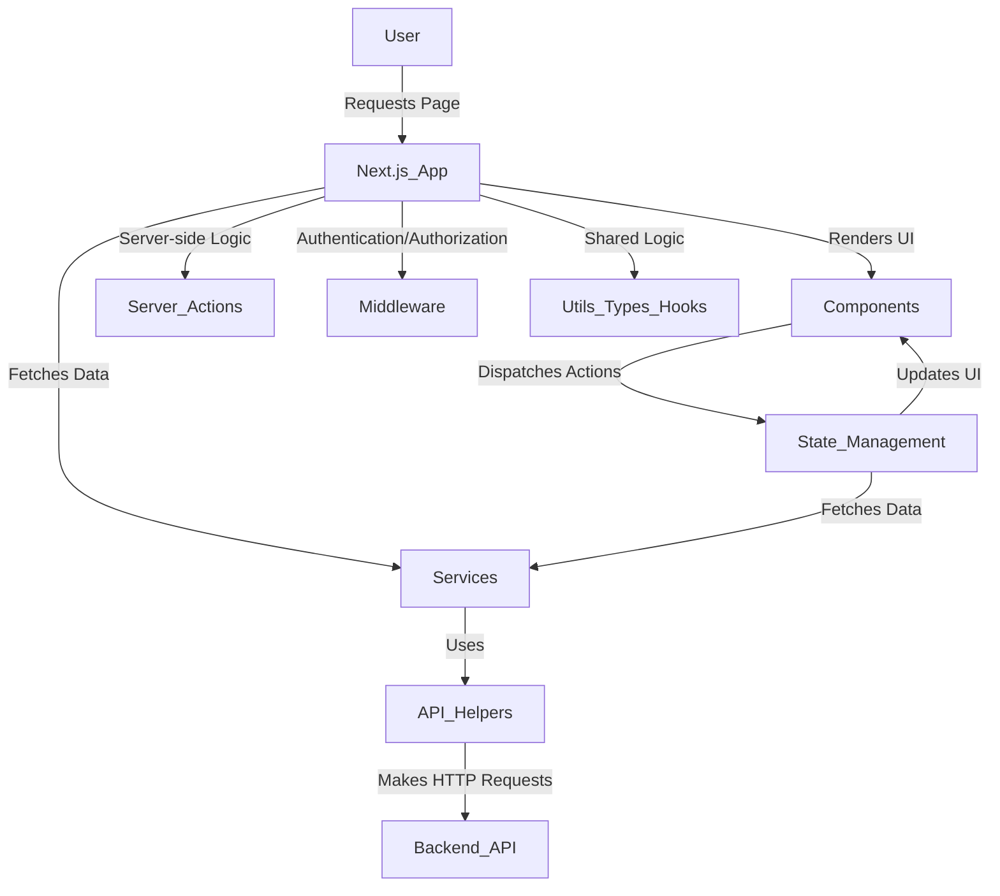

# CodeViz Research Context

> **Note**: This file contains research context from CodeViz. Most recent contexts are at the bottom.

---

## Research Query

i need diagram

*Session: e5a8365b79d9dad84394fa637ee116b1 | Generated: 9/3/2025, 11:12:53 AM*

### Analysis Summary

# Codebase Architecture Diagram

This document outlines the high-level architecture and key components of the `videoportal` application, providing a structured overview of its functionality and interconnections.

## High-Level Architecture

The `videoportal` application is built using **Next.js**, functioning as a full-stack application. It follows a modular structure, separating concerns into distinct layers for UI, API interaction, server-side logic, and shared utilities.

*   **Client-Side Rendering (CSR) / Server-Side Rendering (SSR) / Static Site Generation (SSG):** Handled by **Next.js** pages and components within the [src/app](src/app) and [src/components](src/components) directories.
*   **API Interaction:** Managed through a dedicated [src/api](src/api) layer for Axios configuration and helpers, and [src/services](src/services) for specific API calls to a backend.
*   **Server-Side Logic / Middleware:** Implemented using **Next.js Middleware** ([src/middleware.ts](src/middleware.ts)) and **Server Actions** ([src/server-actions](src/server-actions)) for authentication protection and other server-side operations.
*   **State Management:** Centralized using **Redux Toolkit** (or similar) within the [src/store](src/store) directory.
*   **Shared Utilities & Types:** Common functionalities, constants, and type definitions are organized in [src/utils](src/utils), [src/types](src/types), [src/config](src/config), and [src/hooks](src/hooks).

## Core Application Modules

### **1. Next.js Application Entry Point**

The main entry point for the Next.js application is configured via [next.config.ts](next.config.ts). The root layout and global styles are defined in [src/app/layout.tsx](src/app/layout.tsx) and [src/app/globals.scss](src/app/globals.scss) respectively.

*   **Purpose:** Defines the overall structure, global styling, and metadata for the entire application.
*   **Internal Parts:**
    *   [Root Layout](src/app/layout.tsx): The main layout component wrapping all pages.
    *   [Global Styles](src/app/globals.scss): Contains global CSS rules.
    *   [Providers](src/providers/Providers.tsx): Wraps the application with necessary context providers (e.g., Redux, authentication).
*   **External Relationships:** All pages and nested layouts within [src/app](src/app) inherit from this root layout.

### **2. Pages and Routing**

The application's routes and pages are organized under the [src/app](src/app) directory, following Next.js's App Router conventions.

*   **Purpose:** Defines the different views and their corresponding URLs within the application.
*   **Internal Parts:**
    *   [Public Routes](src/app/(public)): Contains publicly accessible pages like [Home](src/app/(public)/page.tsx), [Explore](src/app/(public)/explore/Explore.tsx), [Search](src/app/(public)/s/page.tsx), [Trending](src/app/(public)/trending/page.tsx), and [Video Games](src/app/(public)/video-games/page.tsx).
    *   [Authentication Routes](src/app/auth): Handles user authentication, including the [Auth Page](src/app/auth/page.tsx) and its associated logic in [Auth.tsx](src/app/auth/Auth.tsx) and [useAuthForms.ts](src/app/auth/useAuthForms.ts).
    *   [User-Specific Routes](src/app/history/page.tsx), [src/app/liked-videos/page.tsx): Pages requiring user authentication, such as [History](src/app/history/page.tsx) and [Liked Videos](src/app/liked-videos/page.tsx).
    *   [Studio Routes](src/app/studio): For content creators, including the [Studio Layout](src/app/studio/layout.tsx) and [Studio Page](src/app/studio/page.tsx).
*   **External Relationships:** Pages interact with [src/components](src/components) for UI elements, [src/services](src/services) for data fetching, and [src/store](src/store) for state management.

### **3. UI Components**

Reusable UI components are located in the [src/components](src/components) directory.

*   **Purpose:** Provides modular and reusable building blocks for the user interface.
*   **Internal Parts:**
    *   [Buttons](src/components/buttons): Contains generic button components like [Button.tsx](src/components/buttons/Button.tsx) and [LinkButton.tsx](src/components/buttons/LinkButton.tsx).
    *   [Field](src/components/field): Input field component [Field.tsx](src/components/field/Field.tsx).
    *   [Layout](src/components/layout): Defines the overall page layout, including [Header](src/components/layout/content/header/Header.tsx) and [Sidebar](src/components/layout/sideBar/SideBar.tsx).
    *   [UI Elements](src/components/ui): Generic UI components like [Heading.tsx](src/components/ui/Heading.tsx), [SkeletonLoaader.tsx](src/components/ui/SkeletonLoaader.tsx), and [VideoItem.tsx](src/components/ui/viedo-item/VideoItem.tsx).
*   **External Relationships:** Components are used by pages in [src/app](src/app) and other components. Layout components define the structure for the entire application.

### **4. API Interaction Layer**

This layer handles communication with the backend API.

*   **Purpose:** Centralizes API request configuration and provides services for specific data operations.
*   **Internal Parts:**
    *   [API Helpers](src/api): Contains [axios.ts](src/api/axios.ts) for Axios instance configuration and [api.helper.ts](src/api/api.helper.ts) for API-related utility functions.
    *   [Services](src/services): Provides functions for interacting with different backend resources:
        *   [Auth Service](src/services/auth.service.ts): Handles authentication-related API calls.
        *   [User Service](src/services/user.service.ts): Manages user-related API calls.
        *   [Video Service](src/services/video.service.ts): Deals with video-related API calls.
*   **External Relationships:** Services are consumed by pages, components, and state management slices to fetch or send data to the backend.

### **5. Server-Side Logic and Middleware**

Next.js's server-side capabilities are utilized for middleware and server actions.

*   **Purpose:** Implements server-side logic, including authentication protection and data processing that occurs on the server.
*   **Internal Parts:**
    *   [Middleware](src/middleware.ts): Global middleware for routing and authentication checks.
    *   [Server Actions](src/server-actions): Contains functions that run directly on the server.
        *   [Protect Login Middleware](src/server-actions/middlewares/protect-login.middlware.ts): Protects routes from authenticated users.
        *   [Protect Studio Middleware](src/server-actions/middlewares/protect-studio.middlware.ts): Protects studio-related routes.
        *   [JWT Verify](src/server-actions/middlewares/utils/jwt-verify.ts): Utility for verifying JWT tokens.
        *   [Redirect to Login](src/server-actions/middlewares/utils/redirect-to-login.ts): Utility for redirecting unauthenticated users.
*   **External Relationships:** Middleware intercepts requests before they reach pages. Server actions are invoked directly from client-side components or pages.

### **6. State Management**

The application uses a state management solution (likely Redux Toolkit given the `slice` naming convention) to manage global application state.

*   **Purpose:** Provides a centralized and predictable way to manage application state across components.
*   **Internal Parts:**
    *   [Auth Slice](src/store/auth.slice.ts): Manages authentication-related state (e.g., user login status, tokens).
    *   [Store Index](src/store/index.ts): Combines different slices into the root store.
*   **External Relationships:** Components dispatch actions to update the state, and subscribe to state changes to re-render. Services might interact with the store to update data after API calls.

### **7. Shared Utilities and Types**

Commonly used functions, constants, and type definitions are organized in dedicated directories.

*   **Purpose:** Promotes code reusability, consistency, and type safety across the application.
*   **Internal Parts:**
    *   [Types](src/types): Defines TypeScript interfaces and types for various data structures, including [auth-form.types.ts](src/types/auth-form.types.ts), [auth.types.ts](src/types/auth.types.ts), [user.types.ts](src/types/user.types.ts), and [video.types.ts](src/types/video.types.ts).
    *   [Constants](src/app/constants): Stores application-wide constants like [color.constants.ts](src/app/constants/color.constants.ts) and [seo.constants.tsx](src/app/constants/seo.constants.tsx).
    *   [Hooks](src/hooks): Custom React hooks, such as [useProfile.ts](src/hooks/useProfile.ts).
    *   [Utils](src/utils): General utility functions like [transform-data.ts](src/utils/transform-data.ts) and [transform-views.ts](src/utils/transform-views.ts).
    *   [Config](src/config): Application configuration, e.g., [page.config.ts](src/config/page.config.ts).
*   **External Relationships:** These utilities and types are imported and used across all layers of the application (pages, components, services, store).

---

## Research Query

CodeViz: Show Webview

*Session: dfc2741e3f8c4668129e013dc5c8eb04 | Generated: 9/3/2025, 11:22:12 AM*

### Analysis Summary

# Codebase Webview Architecture

This report outlines the architecture of the webview, focusing on its structure, key components, and their interactions within the Next.js application. The webview is primarily built around a modular component-based approach, leveraging Next.js's routing and server-side capabilities.

## High-Level Architecture

The application's webview is a **Next.js** application, which renders pages and components on both the server and client sides. The core structure revolves around a root layout, nested layouts for route groups, and individual pages composed of reusable UI components. Authentication and data fetching are integrated to provide dynamic content.

The main entry point for the application's rendering is the root [layout file](src/app/layout.tsx), which wraps the entire application with necessary providers.

## Core Layout and Structure

The primary visual structure of the application is defined by a main [Layout component](src/components/layout/Layout.tsx) which includes a sidebar and a content area.

### Main Application Layout

The [Layout component](src/components/layout/Layout.tsx) serves as the overarching container for the application's user interface.
*   **Purpose:** Provides the consistent structural framework for most pages, including navigation and main content display.
*   **Internal Parts:**
    *   **Sidebar:** Handled by the [SideBar component](src/components/layout/sideBar/SideBar.tsx), which contains navigation links and subscription information.
    *   **Content Area:** Managed by the [Content component](src/components/layout/content/Content.tsx), which dynamically renders page-specific content.
*   **External Relationships:** It's used within the root [public route group layout](src/app/(public)/layout.tsx) to apply the common UI structure to public-facing pages.

### Sidebar Navigation

The [SideBar component](src/components/layout/sideBar/SideBar.tsx) is a key navigation element.
*   **Purpose:** Provides primary navigation links and displays user subscriptions.
*   **Internal Parts:**
    *   [SidebarHeader](src/components/layout/sideBar/header/SidebarHeader.tsx): Displays the application logo.
    *   [SidebarMenu](src/components/layout/sideBar/menus/SidebarMenu.tsx): Renders main navigation items based on [sidebar.data.ts](src/components/layout/sideBar/sidebar.data.ts).
    *   [SidebarSubscriptons](src/components/layout/sideBar/menus/subscriptions/SidebarSubscriptons.tsx): Shows subscribed channels.
    *   [LogOutBtn](src/components/layout/sideBar/LogOutBtn.tsx): Button for user logout.
*   **External Relationships:** Interacts with authentication state (e.g., for logout) and routing for navigation.

### Content Area and Header

The [Content component](src/components/layout/content/Content.tsx) is responsible for displaying the main page content.
*   **Purpose:** Acts as a wrapper for the main content of each page, including a header.
*   **Internal Parts:**
    *   [Header](src/components/layout/content/header/Header.tsx): Contains search functionality and user profile information.
*   **External Relationships:** Receives `children` (the actual page content) from the Next.js page rendering.

The [Header component](src/components/layout/content/header/Header.tsx) provides top-level actions and user information.
*   **Purpose:** Offers search capabilities and displays the user's profile.
*   **Internal Parts:**
    *   [SearchField](src/components/layout/content/header/SearchField.tsx): Input for searching.
    *   [HeaderLinks](src/components/layout/content/header/HeaderLinks.tsx): Additional navigation links.
    *   [HeaderProfile](src/components/layout/content/header/profile/HeaderProfile.tsx): Displays user avatar and profile actions.
*   **External Relationships:** Interacts with search services and user authentication state.

## Page Routing and Components

Next.js handles routing, with pages defined within the `src/app` directory. Route groups like `(public)` organize public-facing pages.

### Public Pages

The `src/app/(public)` directory contains the main public-facing pages of the application.
*   **Purpose:** Serves as the entry point for unauthenticated users and general content browsing.
*   **Key Pages:**
    *   [Home Page](src/app/(public)/page.tsx): The main landing page.
    *   [Explore Page](src/app/(public)/explore/Explore.tsx): For discovering content.
    *   [Search Page](src/app/(public)/s/SearchPage.tsx): Displays search results.
    *   [Trending Page](src/app/(public)/trending/page.tsx): Shows trending videos.
    *   [Verified Page](src/app/(public)/verified/page.tsx): Displays content from verified users.
    *   [Video Games Page](src/app/(public)/video-games/page.tsx): Specific category page.
*   **External Relationships:** These pages fetch data using services (e.g., [video.service.ts](src/services/video.service.ts)) and display it using various UI components (e.g., [VideoItem](src/components/ui/viedo-item/VideoItem.tsx)).

### Authentication Pages

The `src/app/auth` directory manages user authentication.
*   **Purpose:** Handles user login and registration.
*   **Key Components:**
    *   [Auth Page](src/app/auth/page.tsx): The main authentication entry point.
    *   [Auth Component](src/app/auth/Auth.tsx): Contains the authentication forms.
    *   [useAuthForms Hook](src/app/auth/useAuthForms.ts): Manages form state and logic.
*   **External Relationships:** Interacts with the [auth.service.ts](src/services/auth.service.ts) for API calls and updates the [auth.slice.ts](src/store/auth.slice.ts) for state management.

### Other Key Pages

*   [History Page](src/app/history/page.tsx): Displays user's viewing history.
*   [Liked Videos Page](src/app/liked-videos/page.tsx): Shows videos liked by the user.
*   [Studio Pages](src/app/studio/page.tsx): For content creators to manage their videos and settings. This includes a dedicated [Studio Layout](src/app/studio/layout.tsx) and [Studio Settings Page](src/app/studio/settings/page.tsx).

### Reusable UI Components

The `src/components` directory houses various reusable UI components.
*   **Purpose:** To promote reusability, consistency, and maintainability across the application.
*   **Examples:**
    *   [Button](src/components/buttons/Button.tsx) and [LinkButton](src/components/buttons/LinkButton.tsx) for interactive elements.
    *   [Field](src/components/field/Field.tsx) for form inputs.
    *   [Heading](src/components/ui/Heading.tsx) for consistent typography.
    *   [SkeletonLoaader](src/components/ui/SkeletonLoaader.tsx) for loading states.
    *   [VideoItem](src/components/ui/viedo-item/VideoItem.tsx) for displaying video thumbnails and information.
*   **External Relationships:** These components are consumed by various pages and other components throughout the application.

## Data Flow and State Management

### API Services

The `src/services` directory contains services responsible for interacting with the backend API.
*   **Purpose:** Encapsulate API calls and data fetching logic.
*   **Key Services:**
    *   [auth.service.ts](src/services/auth.service.ts): Handles authentication-related API calls.
    *   [user.service.ts](src/services/user.service.ts): Manages user-related data.
    *   [video.service.ts](src/services/video.service.ts): Fetches video data.
*   **External Relationships:** These services utilize the [axios instance](src/api/axios.ts) for HTTP requests and are called by pages, components, or hooks (e.g., [useProfile hook](src/hooks/useProfile.ts)).

### State Management

The `src/store` directory likely uses a state management library (e.g., Redux Toolkit, Zustand) to manage global application state.
*   **Purpose:** Centralize and manage application-wide data.
*   **Key Slices:**
    *   [auth.slice.ts](src/store/auth.slice.ts): Manages authentication state (e.g., user login status, tokens).
*   **External Relationships:** Components dispatch actions to update the state, and select data from the store to render UI.

## Middleware and Authentication

### Next.js Middleware

The [middleware.ts](src/middleware.ts) file handles server-side logic before a request is completed.
*   **Purpose:** To protect routes and perform redirects based on authentication status.
*   **Internal Parts:** It likely uses helper functions from `src/server-actions/middlewares/utils/` such as [get-tokens-from-request.ts](src/server-actions/middlewares/utils/get-tokens-from-request.ts), [jwt-verify.ts](src/server-actions/middlewares/utils/jwt-verify.ts), and [redirect-to-login.ts](src/server-actions/middlewares/utils/redirect-to-login.ts).
*   **External Relationships:** Intercepts incoming requests and can redirect users (e.g., via [next-redirect.ts](src/server-actions/middlewares/utils/next-redirect.ts)) or modify request/response headers.

### Server-Side Protection

The `src/server-actions/middlewares` directory contains server-side middleware functions.
*   **Purpose:** To protect specific routes or actions on the server.
*   **Key Middlewares:**
    *   [protect-login.middlware.ts](src/server-actions/middlewares/protect-login.middlware.ts): Likely prevents logged-in users from accessing login/register pages.
    *   [protect-studio.middlware.ts](src/server-actions/middlewares/protect-studio.middlware.ts): Protects studio-related routes, ensuring only authorized users can access them.
*   **External Relationships:** These middlewares are likely used within Next.js API routes or server components to enforce access control.

